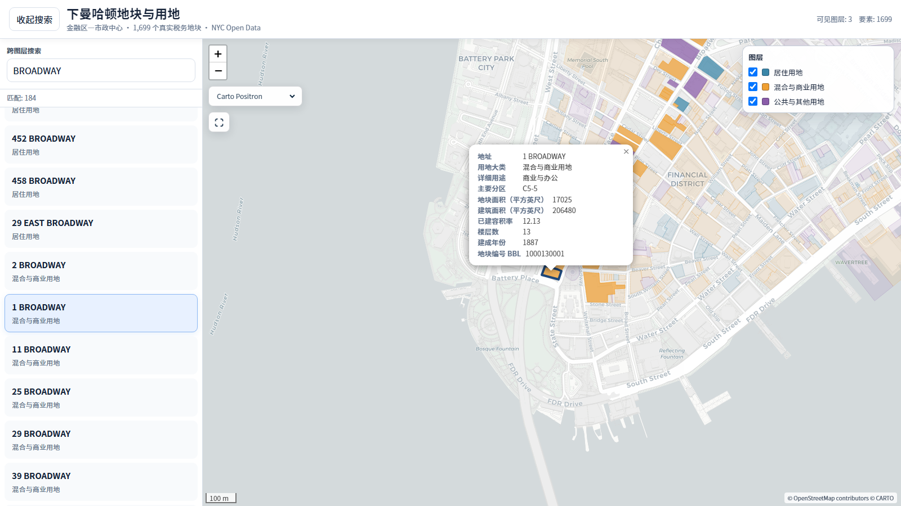
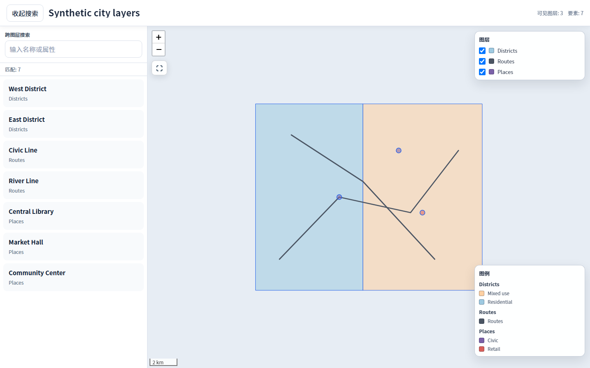

# Interactive Map Builder

[中文](#中文) · [English](#english)

Build lightweight, searchable Leaflet maps and report-ready figures from existing spatial
data—without a frontend build system.

---

## 中文

Interactive Map Builder 是一个给 Codex 和其他 AI 助手使用的地图 Skill。把已有坐标或
空间数据交给它，它会先检查数据和需要确认的选项，再生成可直接打开的交互地图、汇报图片
和论文矢量图。

### 做出来是什么样

下面两张图都是本工具生成的真实 HTML 页面截图，不是另外制作的设计稿。示例数据来自
[NYC Open Data](assets/examples/SOURCES.md)。
在线演示需要联网加载街道底图。

#### 可搜索、可分类的地块地图

搜索道路名称后，左侧会立即列出匹配地块；也可以分别开关居住、商业和公共用地，
点击任意地块查看用途、分区、面积、容积率、楼层和建成年份。

[](https://xlbaoxl.github.io/interactive-map-builder/map-list/)

[打开并操作这张地图](https://xlbaoxl.github.io/interactive-map-builder/map-list/)

#### 可以开关的多图层地图

可以同时查看行政边界、自行车道和公共设施，并随时开关图层或切换底图。

[](https://xlbaoxl.github.io/interactive-map-builder/multilayer/)

[打开并操作这张地图](https://xlbaoxl.github.io/interactive-map-builder/multilayer/)

### 安装和使用（任选一种方法）

#### 方法一：直接在 Codex 里安装

1. 打开 Codex，创建一个新任务。
2. 把下面这句话发给 Codex：

```text
$skill-installer 请从 https://github.com/xlbaoxl/interactive-map-builder 安装这个 Skill，并安装它需要的 Python 依赖。
```

3. 安装完成后创建一个新任务。如果新任务里没有出现这个 Skill，再重启一次 Codex。

#### 方法二：在 Windows PowerShell 里安装

1. 确认电脑已经安装
   [Git](https://git-scm.com/download/win) 和
   [Python 3.9 或更高版本](https://www.python.org/downloads/windows/)。
2. 在 Windows 开始菜单中搜索并打开 **PowerShell**。
3. 把下面几行一次性粘贴进去并按回车：

```powershell
New-Item -ItemType Directory -Force "$HOME\.agents\skills" | Out-Null
git clone https://github.com/xlbaoxl/interactive-map-builder.git `
  "$HOME\.agents\skills\interactive-map-builder"
Set-Location "$HOME\.agents\skills\interactive-map-builder"
py -m pip install .
interactive-map-builder --help
```

手动安装使用的是 Codex 官方说明中的个人 Skill 目录 `$HOME/.agents/skills`。更多背景可查看
[OpenAI 的 Skill 文档](https://learn.chatgpt.com/docs/build-skills)。

#### 安装后这样用

把自己的 GeoJSON、Excel、CSV 或其他空间数据文件拖进 Codex，然后发送：

```text
使用 $interactive-map-builder，把我选择的空间数据做成可以搜索和筛选的交互地图。
```

### 安装到其他 Agent

将整个仓库复制到 Agent 可读取的 Skill/规则目录，让它加载 `SKILL.md`，再运行
`python -m pip install .`。其他 Agent 应继续使用项目内置的配置和构建流程，不要临时
重写一套 Folium 或前端实现。

### 命令行用法（普通用户可以跳过）

如果你熟悉命令行，可以直接运行完整的检查、配置、构建和验证流程：

```powershell
interactive-map-builder inspect `
  assets/examples/map-list/residential.geojson `
  assets/examples/map-list/mixed-commercial.geojson `
  assets/examples/map-list/civic-other.geojson `
  --output inspection.json
interactive-map-builder init-spec inspection.json `
  --template multilayer `
  --output map_spec.json
interactive-map-builder build --spec map_spec.json --out dist
interactive-map-builder verify --dist dist
```

只有一个且没有歧义的图层时，也可以使用快捷命令：

```powershell
interactive-map-builder run data.geojson --output dist
```

### 支持的输入

- GeoJSON / JSON FeatureCollection
- GeoPackage（可指定图层）
- 单数据集 Shapefile ZIP
- CSV 经纬度或 WKT（必须显式 CRS）
- Excel 经纬度或 WKT（必须显式 CRS）
- ArcGIS FeatureServer（先下载为本地 GeoJSON）

不支持：

- 地址地理编码
- 缓冲区、叠加、选址或统计推断
- 矢量瓦片服务
- 离线底图下载
- 根据数值范围猜测 CRS

### 固定输出

每次构建都会生成：

- `map.html`：内嵌 Leaflet、样式、脚本与业务 GeoJSON 的单文件地图
- `map_spec.json`：解析默认值后的构建记录
- `inspection.json`：输入、字段候选、CRS 与模板确认状态
- `build_report.json`：校验、修复、警告、性能指标、哈希与可移植状态
- `README_使用说明.md`：交付给最终使用者的简短说明

静态 preset 另外生成：

- `slide-16x9` → `map_slide_16x9.png`
- `paper` → `map_paper.png`、`map_paper.svg`、`map_paper.pdf`

普通 `build` 不复制源数据，输出的 `map_spec.json` 只是构建记录。需要独立重建包时使用：

```powershell
interactive-map-builder build --spec map_spec.json --out dist --bundle-sources
```

### 完整示例一：主图层 + 上下文图层

检查多个输入后，显式选择主要清单图层：

```powershell
interactive-map-builder inspect sites.geojson districts.geojson `
  --output inspection.json
interactive-map-builder init-spec inspection.json `
  --template map-list `
  --primary-layer sites `
  --output map_spec.json
interactive-map-builder build --spec map_spec.json --out dist --bundle-sources
interactive-map-builder verify --dist dist
```

### 完整示例二：点线面多图层

```powershell
interactive-map-builder inspect districts.geojson routes.geojson places.geojson `
  --output inspection.json
interactive-map-builder init-spec inspection.json `
  --template multilayer `
  --output map_spec.json
interactive-map-builder build --spec map_spec.json --out dist
interactive-map-builder verify --dist dist
```

多图层中的相同要素 ID 默认互不关联。只有各图层显式配置相同语义的 `link_key` 时才会
跨图层高亮。

### 当前限制

- HTML 会一次性创建全部 Leaflet 要素；报告会给出 `light`/`medium` 简化建议，但不会
  自动切换到矢量瓦片。
- 在线底图仍需要网络；业务几何与界面代码可离线使用。
- 系统没有 CJK 字体时静态图继续生成，但报告会提示中文字体回退。
- `linked_view` 是 experimental，只做已有 x/y 变量的 ID 联动，不解释象限或因果关系。
- 多图层任务必须由用户确认 `map-list` 或 `multilayer`；工具不会从几何类型猜测业务意图。

### 路线图

- 用更多真实但可公开的数据包扩充行为 eval
- 改进超大 GeoJSON 的搜索和渐进加载
- 增加可选的视觉回归测试
- 在保持 MapSpec v1 稳定的前提下评估更多静态输出 preset

---

## English

Interactive Map Builder is a map Skill for Codex and other AI assistants. Give it existing
coordinates or spatial data; it checks the inputs and confirms uncertain choices before
generating an interactive map plus presentation- and publication-ready figures.

### What the output looks like

Both images below are screenshots of HTML pages generated by this project, not separate
design mockups. The examples use fixed snapshots from
[NYC Open Data](assets/examples/SOURCES.md).
The online demos need an internet connection to load the street basemap.

#### Searchable, classified parcel map

Search for a street to populate the matching parcel list, toggle residential, commercial, and
public land-use classes, then select any parcel to inspect zoning, area, FAR, floors, and age.

[](https://xlbaoxl.github.io/interactive-map-builder/map-list/)

[Open the interactive map](https://xlbaoxl.github.io/interactive-map-builder/map-list/)

#### Toggleable multilayer map

View the borough boundary, bike routes, and public facilities together, then toggle layers or
switch basemaps.

[](https://xlbaoxl.github.io/interactive-map-builder/multilayer/)

[Open the interactive map](https://xlbaoxl.github.io/interactive-map-builder/multilayer/)

### Install and use it (choose either method)

#### Method 1: install from a Codex task

1. Open Codex and create a new task.
2. Send this message:

```text
$skill-installer Install the Skill from https://github.com/xlbaoxl/interactive-map-builder and install its Python dependencies.
```

3. Create a new task after installation. If the Skill does not appear, restart Codex once.

#### Method 2: install from Windows PowerShell

1. Install [Git for Windows](https://git-scm.com/download/win) and
   [Python 3.9 or newer](https://www.python.org/downloads/windows/).
2. Search for **PowerShell** in the Windows Start menu and open it.
3. Paste these lines and press Enter:

```powershell
New-Item -ItemType Directory -Force "$HOME\.agents\skills" | Out-Null
git clone https://github.com/xlbaoxl/interactive-map-builder.git `
  "$HOME\.agents\skills\interactive-map-builder"
Set-Location "$HOME\.agents\skills\interactive-map-builder"
py -m pip install .
interactive-map-builder --help
```

The manual method uses the global Skill authoring directory documented by Codex:
`$HOME/.agents/skills`. See the
[OpenAI Skill documentation](https://learn.chatgpt.com/docs/build-skills) for details.

#### Use it after installation

Attach a GeoJSON, Excel, CSV, or other spatial data file to Codex and send:

```text
Use $interactive-map-builder to turn my attached spatial data into a searchable, filterable interactive map.
```

### Install for another agent

Copy the complete repository into a Skill or rules directory that the agent can read, instruct
it to load `SKILL.md`, and run `python -m pip install .`. Keep the project's built-in
configuration and build workflow instead of asking the model to generate an unrelated Folium or
frontend implementation.

### Command-line workflow (optional)

If you are comfortable with a terminal, run the full inspect, configure, build, and verify flow:

```bash
interactive-map-builder inspect \
  assets/examples/map-list/residential.geojson \
  assets/examples/map-list/mixed-commercial.geojson \
  assets/examples/map-list/civic-other.geojson \
  --output inspection.json
interactive-map-builder init-spec inspection.json \
  --template multilayer \
  --output map_spec.json
interactive-map-builder build --spec map_spec.json --out dist
interactive-map-builder verify --dist dist
```

For one unambiguous layer:

```bash
interactive-map-builder run data.geojson --output dist
```

### Supported inputs

- GeoJSON / JSON FeatureCollection
- GeoPackage, with explicit layer selection when needed
- A single-dataset Shapefile ZIP
- CSV longitude/latitude or WKT with an explicit CRS
- Excel longitude/latitude or WKT with an explicit CRS
- ArcGIS FeatureServer downloaded to local GeoJSON first

Out of scope:

- Address geocoding
- Buffers, overlays, site selection, or statistical inference
- Vector-tile services
- Offline basemap acquisition
- Guessing a CRS from coordinate ranges

### Fixed outputs

Every build writes:

- `map.html`: single-file Leaflet map with embedded UI and business GeoJSON
- `map_spec.json`: resolved build record
- `inspection.json`: inputs, field candidates, CRS, and template-confirmation state
- `build_report.json`: validation, repairs, warnings, performance, hashes, and portability
- `README_使用说明.md`: short delivery note for the end user

Static presets add:

- `slide-16x9` → `map_slide_16x9.png`
- `paper` → `map_paper.png`, `map_paper.svg`, and `map_paper.pdf`

A normal `build` does not copy source data. Create a portable rebuild bundle explicitly:

```bash
interactive-map-builder build --spec map_spec.json --out dist --bundle-sources
```

### Complete example 1: primary layer plus context

```bash
interactive-map-builder inspect sites.geojson districts.geojson \
  --output inspection.json
interactive-map-builder init-spec inspection.json \
  --template map-list \
  --primary-layer sites \
  --output map_spec.json
interactive-map-builder build --spec map_spec.json --out dist --bundle-sources
interactive-map-builder verify --dist dist
```

### Complete example 2: mixed multilayer explorer

```bash
interactive-map-builder inspect districts.geojson routes.geojson places.geojson \
  --output inspection.json
interactive-map-builder init-spec inspection.json \
  --template multilayer \
  --output map_spec.json
interactive-map-builder build --spec map_spec.json --out dist
interactive-map-builder verify --dist dist
```

Equal feature IDs in different layers remain isolated. Cross-layer highlighting is enabled only
when layers explicitly declare a semantically shared `link_key`.

### Current limitations

- Leaflet objects are still created eagerly. The report recommends `light` or `medium`
  simplification but does not introduce vector tiles.
- Online basemap tiles require a network connection; business geometry and UI remain embedded.
- Static figures continue with a fallback when no CJK font is installed and record a warning.
- `linked_view` is experimental and links existing x/y variables by ID without inventing
  quadrant, causal, or statistical meaning.
- Multi-layer tasks always require explicit confirmation of `map-list` versus `multilayer`.

### Roadmap

- Expand behavioral evals with additional redistributable real-world datasets
- Improve search and progressive rendering for larger GeoJSON payloads
- Add optional visual-regression coverage
- Evaluate more static presets without expanding or fragmenting MapSpec v1

## License

MIT
