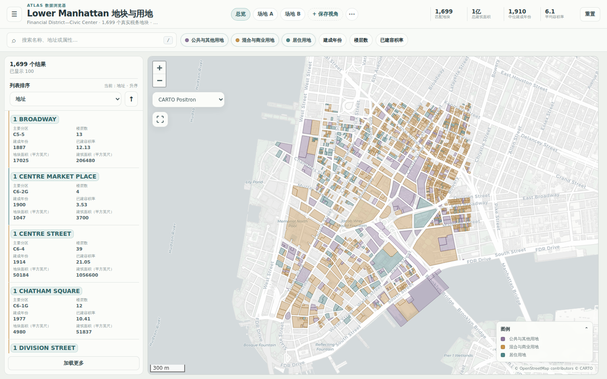
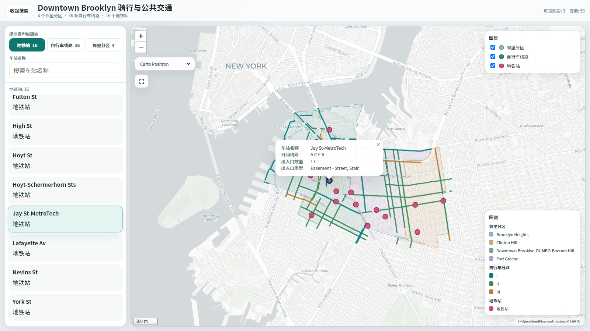

<div align="center">

# Interactive Map Builder

**把已有空间数据交给 AI Agent，得到漂亮、可验证、可直接交付的地图产品。**

[](https://github.com/xlbaoxl/interactive-map-builder/actions/workflows/ci.yml)
[](https://github.com/xlbaoxl/interactive-map-builder/releases)
[](pyproject.toml)
[](references/map-spec.md)
[](LICENSE)

[在线演示](https://xlbaoxl.github.io/interactive-map-builder/zh-CN/) ·
[English](README.md) ·
[版本发布](https://github.com/xlbaoxl/interactive-map-builder/releases) ·
[更新日志](CHANGELOG.md)

</div>

Interactive Map Builder 是一个**以 Codex 为主要使用场景、兼容 Agent Skills 工作流**的地图
Skill。用户即使没有说出 GIS、Leaflet、Web Map 或项目名称，只要表达了“把已有空间数据做成
可搜索、筛选、发送和汇报的地图”这一目标，Agent 也能够识别任务。Skill 会检查 GeoJSON、
GeoPackage、Shapefile、CSV、Excel 或 ArcGIS 数据，只询问真正影响结果的选项，再写入可审计
的 MapSpec，解析一版克制的几何感知视觉起点，生成单文件 Leaflet 地图，并同步导出适合 PPT
和论文的静态图。

```text
用户目标 + 空间数据 → 检查 → 集中确认 → MapSpec → 构建 → 验证 → HTML + PNG/SVG/PDF
```

不需要前端工程，不需要临时手写 Folium 页面，也不会隐藏数据清洗过程。

## 核心特点

- **按用户意图触发**：能够识别“把这张经纬度表做成可搜索页面”“把道路、水系、绿地和
  停车位放到一张汇报图里”等自然表达。
- **用自然语言配置地图**：用户只需说明想完成什么，不必先掌握分级设色、图层控制等 GIS
  术语。
- **确定性构建**：Agent 负责理解需求和编写 MapSpec，Python 引擎统一负责读取、清洗、
  视觉解析、渲染和校验，避免每次临时生成一套不同代码。
- **Atlas Studio Light 默认视觉**：未明确填写的视觉参数会依据几何类型、粗粒度密度和图层
  角色进行解析，让第一版总体协调，同时不替代设计师继续打磨。
- **两种成熟地图产品**：可搜索筛选的“地图＋清单”，以及可独立开关点、线、面数据的
  “多图层地图”。
- **本地单文件交付**：Leaflet、界面逻辑和业务几何都嵌入 `map.html`；只有在线底图需要网络。
- **汇报与论文输出**：同一份配置和解析后的视觉方案可生成 16:9 PNG，以及论文用 PNG、
  SVG 和 PDF。
- **完整构建记录**：自动保存数据检查、几何修复、生成 ID、性能提示、数据来源、文件哈希和
  可移植状态。
- **安全版本预检**：每次调用可按 24 小时缓存检查官方 Release，只更新干净且校验通过的安装，
  断网或本地修改不会阻塞制图任务。
- **安装后自动体检**：`interactive-map-builder doctor` 会离线完成一次真实构建和哈希验证。
- **可靠地图控件**：图层开关固定在可折叠滚动图例上方，默认提供 CARTO Positron、
  OpenStreetMap Standard 和无底图视图；需要凭证的影像底图保持可选。
- **跨 Agent 触发评估**：40 条中英文案例覆盖调用、可选规划、本地与公网交付边界及误触发。

## 在线演示

| 搜索、筛选和比较对象 | 联合查看多个空间主题 |
| --- | --- |
| [](https://xlbaoxl.github.io/interactive-map-builder/zh-CN/map-list/) | [](https://xlbaoxl.github.io/interactive-map-builder/zh-CN/multilayer/) |
| **地图＋清单。** 搜索地址和属性，筛选类别与数值范围，排序记录，观察统计指标变化，并查看选中地块的完整信息。 | **多图层。** 独立开关邻里分区、自行车线路和地铁站，按业务图层搜索，切换底图并查看对象详情。 |
| [打开交互演示 →](https://xlbaoxl.github.io/interactive-map-builder/zh-CN/map-list/) | [打开交互演示 →](https://xlbaoxl.github.io/interactive-map-builder/zh-CN/multilayer/) |

两个演示都由仓库中的确定性引擎根据固定的
[NYC Open Data 数据快照](assets/examples/SOURCES.md)生成，不是另外制作的设计稿。

## 直接描述成果，不必记住工具名称

下面这些表达都属于 Skill 应当识别的任务：

```text
这张 Excel 已经有经纬度，请做成一个能按设施名称搜索、按类型筛选、点击查看详情并分享给
同事的浏览器页面。
```

```text
把地块、道路、水系、绿地和停车位放到一张规划汇报地图里，可以独立开关图层和查看对象信息。
```

```text
同事电脑没有 ArcGIS，请把这些现有图层做成一个 HTML 文件，同时导出一张 16:9 汇报图。
```

用户仍然可以显式调用 `$interactive-map-builder`，但在任务匹配时不需要知道 Skill 名称。

## 快速开始

### 1. 在 Codex 中安装 Skill

打开一个新的 Codex 任务，发送：

```text
$skill-installer 请从 https://github.com/xlbaoxl/interactive-map-builder 安装这个 Skill，并安装它需要的 Python 依赖。安装后运行 interactive-map-builder doctor 和 interactive-map-builder update --check。
```

安装完成后新建任务。如果新任务中没有出现该 Skill，再重启一次 Codex。

### 2. 上传数据并描述目标

```text
把我上传的空间数据做成可以搜索和筛选的中文交互地图，同时导出一张 16:9 汇报图。
```

Skill 会先检查数据，并在仍有不确定项时维护一份简短需求清单：

```markdown
- [x] Confirmed：用户已明确，或数据已经证明
- [~] Inferred：Skill 根据数据提出的建议，可以修改
- [ ] Needs confirmation：构建前必须确认
```

它只会集中询问一次真正影响结果的内容，例如 CRS、模板、主图层、分类含义、展示字段、输出
格式和地图受众语言。

### 3. 验证安装结果

```bash
interactive-map-builder doctor
```

`doctor` 会在临时目录中生成一张坐标表，离线完成数据读取、地图构建、Leaflet 资源检查和输出
哈希验证，返回 JSON 结果后删除临时文件。该命令不会下载底图，也不会发送使用统计。可使用
`interactive-map-builder update --check` 单独检查版本状态。

<details>
<summary><strong>手动安装</strong></summary>

**Windows PowerShell**

```powershell
New-Item -ItemType Directory -Force "$HOME\.agents\skills" | Out-Null
git clone https://github.com/xlbaoxl/interactive-map-builder.git `
  "$HOME\.agents\skills\interactive-map-builder"
Set-Location "$HOME\.agents\skills\interactive-map-builder"
py -m pip install .
interactive-map-builder doctor
interactive-map-builder update --check
```

**macOS 或 Linux**

```bash
mkdir -p "$HOME/.agents/skills"
git clone https://github.com/xlbaoxl/interactive-map-builder.git \
  "$HOME/.agents/skills/interactive-map-builder"
cd "$HOME/.agents/skills/interactive-map-builder"
python3 -m pip install .
interactive-map-builder doctor
interactive-map-builder update --check
```

</details>

<details>
<summary><strong>从正式版本安装</strong></summary>

从 v0.3.1 开始，每个 GitHub Release 会同时发布：

- `interactive-map-builder-skill-vX.Y.Z.zip`：包含 `SKILL.md`、Agent 元数据、参考文档、确定性
  引擎和网页资源的精简 Skill 包；
- Python wheel 与源码包：用于常规 Python 安装；
- `SHA256SUMS.txt`：用于发行资产校验和受管 Skill 安全更新。

精简 Skill 包不包含演示数据、截图、测试和 CI 文件。将它解压到 Agent Skills 目录后，运行
`python -m pip install .`，再运行 `interactive-map-builder doctor`。

</details>

<details>
<summary><strong>在 Claude Code 或其他 Agent Skills 客户端中使用</strong></summary>

把完整仓库或正式版本中的 Skill ZIP 放到客户端能够读取的 Skill 或规则目录，让它加载
`SKILL.md`，然后安装一次确定性引擎：

```bash
python -m pip install .
interactive-map-builder doctor
```

工作流不依赖特定客户端界面：检查数据、维护需求清单、写入当前 MapSpec、使用打包引擎构建、
验证并交付完整 `dist` 目录。

</details>

## 版本更新、计划模式与公网发布

每次 Skill 任务开始时，Agent 会运行 `interactive-map-builder update --auto`。更新检查按 24 小时
缓存，只会修改官方仓库中干净的 `main` 分支，或文件未被改动且通过 Release 校验和与清单验证的
正式 Skill ZIP。断网、本地修改、只读目录或非标准安装只会返回提示，不会阻塞地图制作。设置
`IMB_DISABLE_AUTO_UPDATE=1` 可以关闭更新检查。

更新采用事务式处理：替换经过校验的版本后会重新安装引擎并运行离线 `doctor`；安装或体检失败
时，自动恢复此前的 Git 提交或原清单管理的全部文件。完整规则见
[安全更新策略](references/update-policy.md)。

v0.3.2 是自动更新机制的起始版本。用户需要先通过仓库或 Release 安装一次 v0.3.2，此后的兼容
版本即可由 Skill 预检发现并安全应用。

当 Codex 任务确实复杂，例如包含多个独立图层、多个待确认设计选项，或需要协调 HTML、汇报图和
论文图时，Agent 可以在第一轮用一句话将 Plan mode 作为可选建议。用户不切换也会立即继续检查
数据；明确的单图层任务不会收到这项提示。

正常交付物是可移动、可发送的本地 `map.html`。“发给同事”表示发送文件，不等于把内嵌空间数据
发布到互联网。只有用户明确提出公开网址时，才会在确认托管平台和数据公开权限后进入独立部署
流程；公网托管不属于地图构建的默认输出。

## Atlas Studio Light 视觉系统

v0.4 引入的是轻量视觉默认值解析器，不是一套全包式自动设计系统。当 MapSpec 没有明确填写
底层视觉参数时，引擎根据几何类型、粗粒度要素/坐标密度、模板角色和稳定绘制顺序生成一版
克制的初始图面：

- 密集点图层自动使用更小的点和更低的填充强度；
- 点、线、面分别使用适合自身的尺寸、填充和描边；
- `map-list` 主图层保持突出，背景图层自动后退；
- 多图层地图固定面—线—点层级，并聚焦当前业务图层；
- HTML、图例、卡片、PNG、SVG 和 PDF 共用同一份解析结果；
- 自动分类配色最多使用八个明确颜色，不再循环形成彩虹图。

用户或 Agent 明确写入的 MapSpec 参数始终优先。系统只负责提供达到总体协调、可以继续汇报和
修改的起点，不替代规划师或设计师完成项目专属表达。用户仍可通过自然语言或直接编辑 MapSpec
继续调整颜色、尺寸、透明度、字段和层级。所有推断结果都会记录在 `build_report.json` 的
`visual` 与 `visual_system` 中。

## 选择哪种地图

| 用户目标 | 底层模板 | 适用数据 | 主要交互 |
| --- | --- | --- | --- |
| 查找、筛选、排序和比较每条记录 | `map-list` | 地块、建筑、设施、门店、项目、事件、候选地点 | 搜索、分类与数值筛选、排序、动态统计、地图清单联动、详情面板 |
| 同时查看多个相互独立的空间主题 | `multilayer` | 边界、道路、线路、设施、环境和规划背景 | 图层开关、分图层搜索、点线面样式、图例、底图切换、对象详情 |

`map-list` 也可以附带行政区或道路等背景图层。存在多个输入时，Skill 不会仅凭几何类型猜测
业务意图，而会要求用户确认模板和主图层。

## 默认底图与多图层控件

新建 MapSpec 默认包含两张不需要用户凭证的在线底图：以浅色、低干扰的 **CARTO Positron**
为默认底图，**OpenStreetMap Standard** 用于查看详细道路与地名。底图选择器还提供**无底图**，
在线瓦片连续失败时会自动回退，因此业务图层、搜索和图层控制仍然可用。**Esri World Imagery**
仅在用户提供经过授权的服务地址或令牌，并接受浏览器端凭证可能出现在 HTML 中时加入。

多图层产品将图层开关固定在控制区上方，图例排列在下方；图例内容过长时内部滚动，窄屏默认
收起，因此大量分类不会再遮挡图层关闭按钮。

## 支持的数据

| 输入格式 | 要求 |
| --- | --- |
| GeoJSON / JSON FeatureCollection | 几何和 CRS 可正常读取 |
| GeoPackage | 包含多个候选图层时需要明确选择 |
| Shapefile ZIP | 每个 ZIP 只放一套 Shapefile；保留 `.cpg`/GDAL 编码识别 |
| CSV | 具有经纬度字段或 WKT，并明确源 CRS |
| Excel | 具有经纬度字段或 WKT，并明确源 CRS |
| ArcGIS FeatureServer | 先下载为本地 GeoJSON 快照，再进入地图构建 |

在推荐地图之前，检查阶段会输出要素数量、几何类型、CRS、字段样例、候选 ID、名称、分类字段、
歧义和性能提示。

## 交付内容

| 文件 | 用途 |
| --- | --- |
| `map.html` | 内嵌业务几何和全部界面逻辑的本地单文件 Leaflet 地图 |
| `map_slide_16x9.png` | 启用汇报 preset 时生成的 1920×1080 图片 |
| `map_paper.png` / `.svg` / `.pdf` | 启用论文 preset 时生成的出版图件 |
| `map_spec.json` | 解析后的可复用构建契约 |
| `inspection.json` | 输入、CRS、字段候选和待确认项 |
| `build_report.json` | 数量、修复、警告、性能、哈希和可移植状态 |
| `README_USAGE.md` | 面向地图接收者的本地化使用说明 |

普通构建不会复制源数据，`map_spec.json` 只作为原项目中的构建记录。需要把整个结果移动到其他
电脑后独立重建时，使用 `--bundle-sources`。

## 工作原理

```text
用户需求 + 空间文件
          │
          ▼
       检查数据
 CRS · 几何 · 字段 · 数据规模
          │
          ▼
  一次性确认无法自动判断的选项
          │
          ▼
       MapSpec 1.1
          │
          ▼
 Atlas Studio Light 解析器
  几何 · 密度 · 角色 · 层级
          │
          ▼
     确定性 Python 引擎
      读取 · 规范化 · 渲染
          │
          ▼
 校验数量、文件、QA 接口、
 数据来源、哈希和浏览器交互
          │
          ▼
 可发送 HTML + 汇报与论文图件
```

打包的 [JSON Schema](scripts/mapcore/resources/map-spec.schema.json) 是 MapSpec 唯一的机器契约。
配置只接受规范的 `snake_case` 字段；不支持的字段和 Schema 版本会被直接拒绝，不会静默迁移。

<details>
<summary><strong>命令行工作流</strong></summary>

只有一个且没有歧义的图层时：

```bash
interactive-map-builder run data.geojson --locale zh-CN --output dist
```

需要显式控制和保存配置时：

```bash
interactive-map-builder inspect sites.geojson districts.geojson \
  --output inspection.json

interactive-map-builder init-spec inspection.json \
  --template map-list \
  --primary-layer sites \
  --locale zh-CN \
  --output map_spec.json

interactive-map-builder build --spec map_spec.json --out dist --bundle-sources
interactive-map-builder verify --dist dist
```

独立的点、线、面业务图层使用 `--template multilayer`，不填写 `--primary-layer`。

</details>

## 能力边界

Interactive Map Builder 专注于**已有空间数据 → 可交付地图成品**，目前不负责：

- 把地址批量转换成坐标；
- 缓冲区、叠加、路径规划、选址模型和统计推断；
- 矢量瓦片服务和千万级要素 WebGIS；
- 离线底图下载；
- 根据坐标数值猜测 CRS；
- 三维地形、建筑和数字孪生；
- 维护已有的定制 Leaflet 或 React 应用；
- 在用户没有明确提出部署且未确认数据公开权限时自动发布公网网址。

对于较大的 GeoJSON，构建报告会建议使用 `light` 或 `medium` 几何简化，但不会在用户不知情时
切换渲染引擎。

## 项目状态

项目当前处于 **v0.4.0 Beta**。这一版本新增 Atlas Studio Light 视觉系统：使用一个小型、
渲染器中立的解析层统一点线面默认值、粗粒度密度、稳定层级以及 HTML 与静态图输出，并同步
刷新编辑式 UI。它没有增加新模板、主题市场、聚合、热力图或更大的 MapSpec 契约。引擎负责
给出更好的第一版，项目专属的视觉打磨仍由用户与 Agent 完成。

已经完成的变化见[更新日志](CHANGELOG.md)。

## 开发与测试

```bash
python -m pip install -r requirements-dev.txt
python scripts/evaluate_triggers.py validate
python -m pytest -q -m "not browser"
python -m playwright install chromium
python -m pytest -q -m browser
```

构建中英文 GitHub Pages 演示和精简 Skill 发行包：

```bash
python scripts/build_demo_site.py --output _site
python scripts/build_skill_package.py
```

CI 覆盖 Python 3.9、3.10、3.12、触发评估集验证、Chromium 交互测试、wheel 构建、离线安装体检、
仓库外构建验证和 Skill ZIP。`main` 中出现新的包版本且 CI 全部通过后，会自动创建对应的 GitHub
Release。

## 许可证

[MIT](LICENSE)
